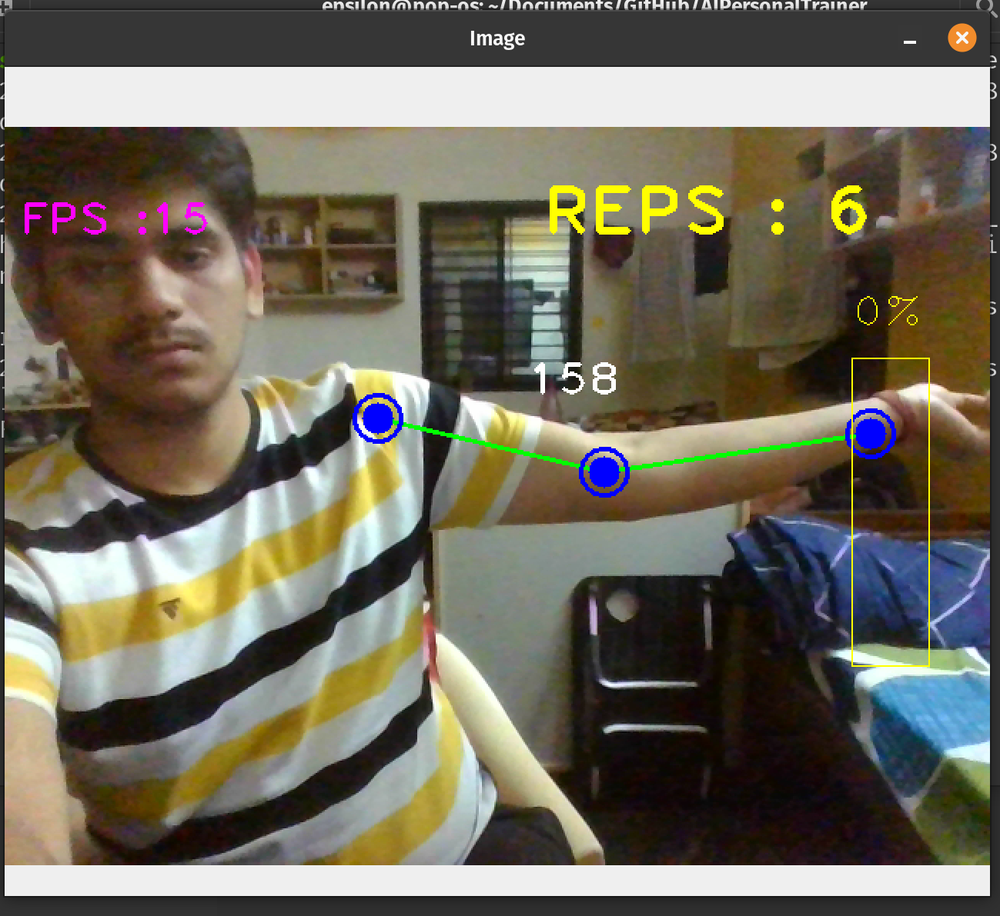
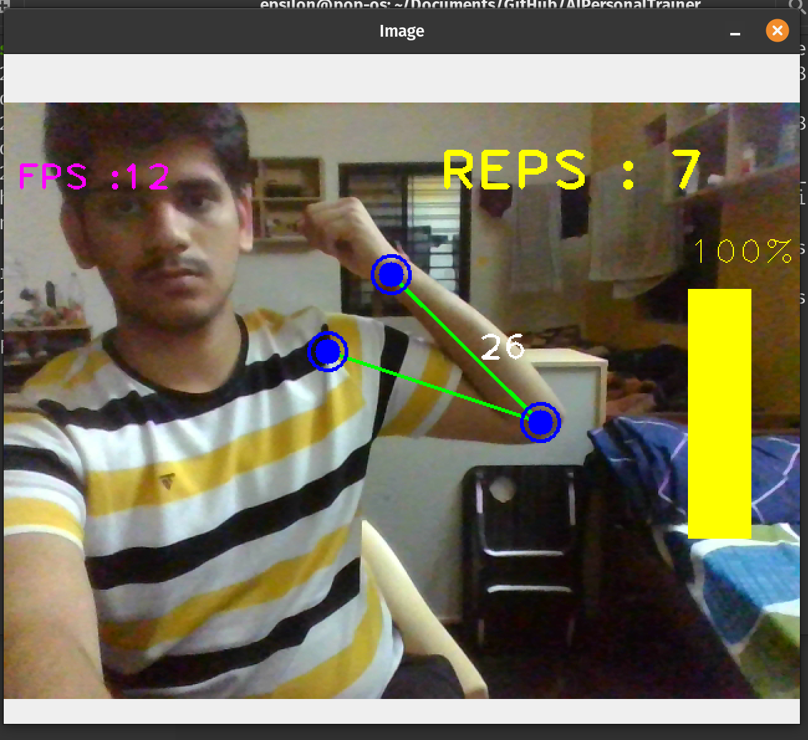
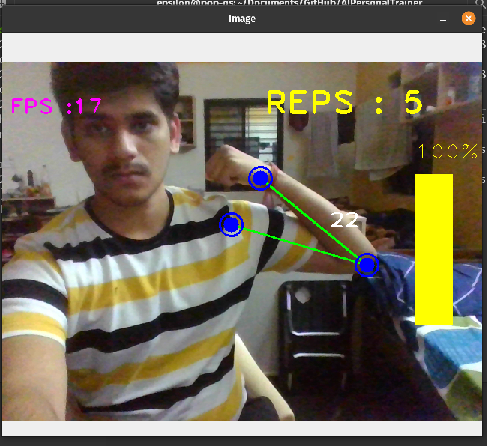

# Gym Trainer with MediaPipe Pose Estimation

This personal trainer application utilizes MediaPipe Pose Estimation to track and calculate repetitions for various exercises including biceps curls, pull-ups, push-ups, chin-ups, and other exercises involving a 120-degree movement of the elbow.

## Features

- Real-time pose estimation using MediaPipe.
- Automatic counting of repetitions for specific exercises.
- Supports tracking for biceps curls, pull-ups, push-ups, chin-ups, and more.
- User-friendly interface for monitoring workout progress.

## Requirements

- Python 3.10
- MediaPipe
- OpenCV

## Installation

1. Clone this repository:
```
    git clone https://github.com/KumarSampurn/AIPersonalTrainer
```

## Usage

1. Run the main script:
```
   python3 trainer.py
```

2. Follow the on-screen instructions to start your workout session.
3. Ensure proper lighting and camera setup for accurate pose estimation.

## Sample Screenshots







## License

This project is licensed under the MIT License - see the [LICENSE](LICENSE) file for details.
